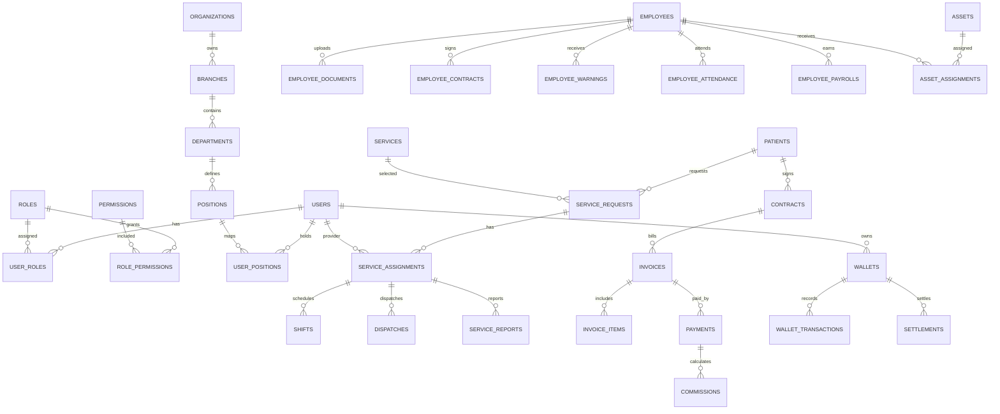

# ERD

```mermaid
erDiagram
    USERS ||--o{ USER_ROLES : has
    ROLES ||--o{ USER_ROLES : assigned
    ROLES ||--o{ ROLE_PERMISSIONS : grants
    PERMISSIONS ||--o{ ROLE_PERMISSIONS : included
    ORGANIZATIONS ||--o{ BRANCHES : owns
    BRANCHES ||--o{ DEPARTMENTS : contains
    DEPARTMENTS ||--o{ POSITIONS : defines
    USERS ||--o{ USER_POSITIONS : holds
    POSITIONS ||--o{ USER_POSITIONS : maps

    PATIENTS ||--o{ SERVICE_REQUESTS : requests
    SERVICES ||--o{ SERVICE_REQUESTS : selected
    SERVICE_REQUESTS ||--o{ SERVICE_ASSIGNMENTS : has
    USERS ||--o{ SERVICE_ASSIGNMENTS : provider
    SERVICE_ASSIGNMENTS ||--o{ SHIFTS : schedules
    SERVICE_ASSIGNMENTS ||--o{ DISPATCHES : dispatches
    SERVICE_ASSIGNMENTS ||--o{ SERVICE_REPORTS : reports
    PATIENTS ||--o{ CONTRACTS : signs
    CONTRACTS ||--o{ INVOICES : bills
    INVOICES ||--o{ INVOICE_ITEMS : includes
    INVOICES ||--o{ PAYMENTS : paid_by
    PAYMENTS ||--o{ COMMISSIONS : calculates
    USERS ||--o{ WALLETS : owns
    WALLETS ||--o{ WALLET_TRANSACTIONS : records
    WALLETS ||--o{ SETTLEMENTS : settles

    EMPLOYEES ||--o{ EMPLOYEE_DOCUMENTS : uploads
    EMPLOYEES ||--o{ EMPLOYEE_CONTRACTS : signs
    EMPLOYEES ||--o{ EMPLOYEE_WARNINGS : receives
    EMPLOYEES ||--o{ EMPLOYEE_ATTENDANCE : attends
    EMPLOYEES ||--o{ EMPLOYEE_PAYROLLS : earns
    ASSETS ||--o{ ASSET_ASSIGNMENTS : assigned
    EMPLOYEES ||--o{ ASSET_ASSIGNMENTS : receives
```
